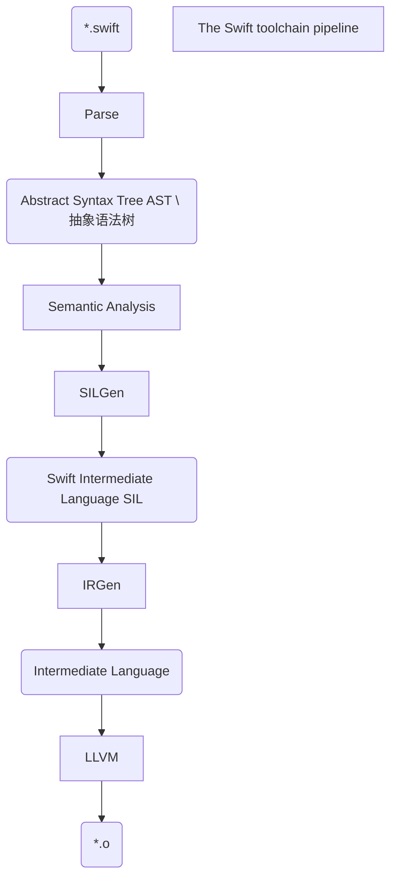

# 《Exper Swift》学习笔记


## 学习的转变

最近了解到还有一个网站叫[raywenderlich](https://www.raywenderlich.com/)，进去一看全英文直接傻眼。之前有一种想法是这样的，程序员不必学英文，因为前面会有优秀的程序员翻译总结给我们，我们只要跟随大神就行了。但是这样想的话一下就缩小了自己的学习范围，意味着只能看大神翻译的东西了。有一次我要学习关于静态库开发，找了很多中文的内容，都是怎么实现，但是一个整体的开发流程还是没有的。然后在这个网站中找到了一篇文章，发现有原理，有流程，还有一些优秀的封装，demo。如果这个网站有的话，我会优先看这个网站的。但是英文是个问题，因为有很多编程的专业名词，翻译软件不一定能翻译出来，我开始是不看翻译，一个单词一个单词自己翻译出来的，但是这样实在是太慢了，到现在只能用一个偷懒的方法，只有专业名词的时候，那一段自己翻译。这样是能提高一些速度，但是理解可能也会差点。英文不好，简单的内容翻译过来也很懵。这样就出现一个循环，想让编程进步就要看一些英文文章，但是英文差速度又太慢了，不过慢慢来吧。也给同iOS学习者推荐这个网站吧。


## 简介

这篇文章是我学习[raywenderlich](https://www.raywenderlich.com/) 中的一本书《Exper Swift》，这本书我目前只看了一点，给我的感觉是比较细致的讲Swift的基础知识。我将觉得重要的记忆点记录下来，方便以后自己去查找，不是专业的文章。但是如果有想一起看的伙伴也可以看一下。提一些建议给我也行，有人交流的学的话，可能更加努力点。


## Swift 编译器

Swift 编译器负责将源代码转换成可以链接到的可执行文件的目标代码。它运行在LLVM编译器之中，数据流如下：




像Swift 这样的高级语言转换成机器代码并且高效的在设备上运行，这个过程叫做 `lowering` 。上图圆角矩形代表输入或输出的数据。从高到低的每一个步骤都值得理解：

1. **Parse**:  Swift 源代码是要先解析为标记，然后放入AST（抽象语法树）中。你可以理解为一棵树，其中的每个表达式都是一个节点。然后节点还保存了源的位置信息，所以我们在检测到错误的时候，编译器可以告诉我们错误的位置。

2. **Semantic Analysis**：在这个步骤里，编译器使用了AST去分析项目代码的意思。这个步骤也是进行 **type checking** （类型检查）的地方。检查后将AST传递到 **SILGen** 阶段。

3. **SILGen**：和以前不一样不需要经过**Clang** 这一步。AST 转化成**Swift Intermediate Language**（Swift 中间语言）。**SIL** 包含了计算的 **basic blocks** (计算块) 和理解 Swift 类型，参考计数和派发（dispatch）的规范。SIL还包含源位置信息，因此它可以产生有意义的错误。

   这一段对我英文来说是个挑战，贴原文：

   This phase departs from previous compiler pipelines such as **Clang**, which didn’t have this step. The AST gets lowered into **Swift Intermediate Language** (**SIL**). SIL contains **basic blocks** of computation and understands Swift Types, reference counting and dispatch rules. There are two flavors of SIL: raw and canonical. Canonical SIL results from raw SIL run through a minimum set of optimization passes (even when all optimizations are turned off). SIL also contains source location information so it can produce meaningful errors.

4. **IRGen**： 这一步让 **SIL** 变成了 LLVM的中间语言。这时候指令不再是Swift指令。但IR 仍然十分抽象。例如 **SIL**，**IR** 是静态的单一声明形式。它模拟了无限数量的寄存器，让它容易去发现优化。它不知道任何关于Swift的类型。*这里也很不懂，然后理解具体意思是，原本的Swift指令已经被转换。*

5. **LLVM**：最后一步，优化IR，和转换为不同平台的机器指令。包括ARM、x86等。

上面的过程是，Swift编译器如何生成目标代码的过程。


## Definite initialization 清晰的初始化

Swift 是一种安全的语言，默认情况下很难访问未初始化的内存。SILGen 通过一个称为确定初始化的检查过程提供保证。考虑一下这个例子:

```swift
final class Printer {
  var value: Int
  init(value: Int) { self.value = value }
  func print() { Swift.print(value) }
}

func printTest() {
  var printer: Printer
  if .random() {
    printer = Printer(value: 1)
  }
  else {
    printer = Printer(value: 2)
  }
  printer.print()
}

printTest()
```

这段代码编译并运行良好。但是如果注释掉 `else` 子句，则由于 SIL，编译器将正确标记一个错误(初始化前使用的变量‘ printer’)。这个错误是可能的，因为 SIL 理解对 `Printer` 的方法调用的语义。如果`if` 不被执行，那么`printer` 是危险的。


## Allocation and devirtualization 分配与虚拟化

SILGen 帮助优化分配和方法调用。

看一个例子：

```swift
class Magic {
    func number() -> Int { return 0 }
}

final class SpecialMagic: Magic {
    override func number() -> Int { return 42 }
}

public var number: Int = -1

func magicTest() {
    //42
    let specialMagic = SpecialMagic()
    //实际类型 还是SpecialMagic
    let magic: Magic = specialMagic
    //42
    number = magic.number()
}

magicTest()
```

在 `magicTest` 函数中，创建一个 `SpecialMagic` 类型，然后又创建一个基类引用，调用`number()`设置`number`。它使用<u>类的虚表</u>查找正确的函数，该函数返回值42。


## Raw SIL 原始SIL

将上面的代码放到一个文件中，将文件取名为`magic.swift` , 然后在**terminal** 执行：

```
swiftc -O -emit-silgen magic.swift > magic.rawsil
```

就可以得到编译器优化和创建的原始SIL，输出文件为magic.rawsil。

打开magic.rawsil 就可以向下滚动，会发现magicTest()函数的定义：

```
// magicTest()
sil hidden [ossa] @$s5magic0A4TestyyF : $@convention(thin) () -> () {
bb0:
  %0 = global_addr @$s5magic6numberSivp : $*Int   // user: %14
  %1 = metatype $@thick SpecialMagic.Type         // user: %3
  // function_ref SpecialMagic.__allocating_init()
  %2 = function_ref @$s5magic12SpecialMagicCACycfC : $@convention(method) (@thick SpecialMagic.Type) -> @owned SpecialMagic // user: %3
  %3 = apply %2(%1) : $@convention(method) (@thick SpecialMagic.Type) -> @owned SpecialMagic // users: %18, %5, %4
  debug_value %3 : $SpecialMagic, let, name "specialMagic" // id: %4
  %5 = begin_borrow %3 : $SpecialMagic            // users: %9, %6
  %6 = copy_value %5 : $SpecialMagic              // user: %7
  %7 = upcast %6 : $SpecialMagic to $Magic        // users: %17, %10, %8
  debug_value %7 : $Magic, let, name "magic"      // id: %8
  end_borrow %5 : $SpecialMagic                   // id: %9
  %10 = begin_borrow %7 : $Magic                  // users: %13, %12, %11
  %11 = class_method %10 : $Magic, #Magic.number : (Magic) -> () -> Int, $@convention(method) (@guaranteed Magic) -> Int // user: %12
  %12 = apply %11(%10) : $@convention(method) (@guaranteed Magic) -> Int // user: %15
  end_borrow %10 : $Magic                         // id: %13
  %14 = begin_access [modify] [dynamic] %0 : $*Int // users: %16, %15
  assign %12 to %14 : $*Int                       // id: %15
  end_access %14 : $*Int                          // id: %16
  destroy_value %7 : $Magic                       // id: %17
  destroy_value %3 : $SpecialMagic                // id: %18
  %19 = tuple ()                                  // user: %20
  return %19 : $()                                // id: %20
} // end sil function '$s5magic0A4TestyyF'
```

上面的代码是三行函数 magicTest()的SIL定义。Label bb0代表基本块0，是计算单元。% 1、% 2等值是虚拟寄存器。SIL 是在单一静态分配形式，所以寄存器是无限的，从来没有重用。细节并不重要，大家可以大致了解一下编译器如何分配、声明、调用和释放对象的。


## Canonical SIL

接下来，运行`Terminal` 命令：

```
swiftc -O -emit-sil magic.swift > magic.sil
```

输出文件：`magic.SIL` , 查看底部 magicTest():

```
// magicTest()
sil hidden @$s5magic0A4TestyyF : $@convention(thin) () -> () {
bb0:
  %0 = global_addr @$s5magic6numberSivp : $*Int   // user: %3
  %1 = integer_literal $Builtin.Int64, 42         // user: %2
  %2 = struct $Int (%1 : $Builtin.Int64)          // user: %4
  %3 = begin_access [modify] [dynamic] [no_nested_conflict] %0 : $*Int // users: %4, %5
  store %2 to %3 : $*Int                          // id: %4
  end_access %3 : $*Int                           // id: %5
  %6 = tuple ()                                   // user: %7
  return %6 : $()                                 // id: %7
} // end sil function '$s5magic0A4TestyyF'
```

进行了优化，代码少了很多。但是内容却是相同的。主要工作是将整数文字42存储到全局地址位置存储区% 2到% 3: $* Int。没有初始化或取消初始化类，也没有调用任何虚方法。但这里只是一种概括。

在 Swift 中，所有内容都从堆上初始化开始，SIL 分析可以将分配移到堆栈中，甚至完全删除它。虚函数调用也可以通过优化过程进行非虚拟化，直接调用甚至内联调用。


## Building ifelse

下来跟书一起学习实现一个ifelse() 语句。

这个函数看起来是这样的：

```
ifelse(condition, valueTrue, valueFalse)
```

有点类似三目运算符，1.valueTrue：valueFalse。

```swift
func ifelse(condition: Bool,
            valueTrue: Int,
            valueFalse: Int) -> Int {
    if condition {
        return valueTrue
    } else {
        return valueFalse
    }
}
let value = ifelse(condition: Bool.random(),
                   valueTrue: 100,
                   valueFalse: 0)
```

这个函数存在一个问题，用户只能使用Int，需要去做一点改进，让更多的人觉得好用：

```swift
func ifelse(_ condition: Bool, 
            _ valueTrue: Int, 
            _ valueFalse: Int) -> Int {
  condition ? valueTrue : valueFalse
}

let value = ifelse(.random(), 100, 0)
```

对于经常使用的语言构造，去掉参数标签是有意义的。

```swift
func ifelse(_ condition: Bool, 
            _ valueTrue: Int, 
            _ valueFalse: Int) -> Int {
  condition ? valueTrue : valueFalse
}
func ifelse(_ condition: Bool, 
            _ valueTrue: String, 
            _ valueFalse: String) -> String {
  condition ? valueTrue : valueFalse
}
func ifelse(_ condition: Bool, 
            _ valueTrue: Double, 
            _ valueFalse: Double) -> Double {
  condition ? valueTrue : valueFalse
}
func ifelse(_ condition: Bool, 
            _ valueTrue: [Int], 
            _ valueFalse: [Int]) -> [Int] {
  condition ? valueTrue : valueFalse
}	
```

如果想让更多类型使用，就需要重载更多。

但是这样就要写更多的方法，这个时候你也许会觉得使用 `Any` ,可以解决。

```swift
func ifelse(_ condition: Bool,
            _ valueTrue: Any,
            _ valueFalse: Any) -> Any {
  condition ? valueTrue : valueFalse
}

let value = ifelse(.random(), 100, 0) as! Int
```

```swift
let value = ifelse(.random(), "100", 0) as! Int
```

但是必需回溯到所需的原始类型。如果类型不同，那么在生产环境中容易崩溃。

```swift
func ifelse<V>(_ condition: Bool,
               _ valueTrue: V,
               _ valueFalse: V) -> V {
  condition ? valueTrue : valueFalse
}

// let value = ifelse(.random(), "100", 0)  // doesn’t compile anymore
let value = ifelse(.random(), 100, 0)
```

使用泛型是一个不错的选择。既保留了类型信息，又约束参数与返回类型相同。


## Deferring execution 推迟执行

```swift
func expensiveValue1() -> Int {
  print("side-effect-1")
  return 2
}

func expensiveValue2() -> Int {
  print("side-effect-2")
  return 1729
}

let taxicab = ifelse(.random(), 
                     expensiveValue1(), 
                     expensiveValue2())
```

这样写看起来很简便，但是还没有完成：

当我们这样运行的话，2个方法都会被运行，当然我们想要的效果是只执行一个结果。我们可以通过一个闭包去解决这个问题：

```swift
func ifelse<V>(_ condition: Bool,
               _ valueTrue: () -> V,
               _ valueFalse: () -> V) -> V {
  condition ? valueTrue() : valueFalse()
}
```

```swift
func expensiveValue1() -> Int {
  print("side-effect-1")
  return 2
}

func expensiveValue2() -> Int {
  print("side-effect-2")
  return 1729
}

let taxicab = ifelse(.random(),
                     { expensiveValue1() },
                     { expensiveValue2() })
print(taxicab)
```

添加闭包以后，确实只执行了一个表达式。但是我们的写法变的奇怪起来。但有趣的是，Swift可以解决这个问题：

```swift
func ifelse<V>(_ condition: Bool,
               _ valueTrue: @autoclosure () -> V,
               _ valueFalse: @autoclosure () -> V) -> V {
  condition ? valueTrue() : valueFalse()
}

let value = ifelse(.random(), 100, 0 )

let taxicab = ifelse(.random(),
                     expensiveValue1(),
                     expensiveValue2())
```

用@autoclosure 装饰参数类型会导致编译器自动将参数包装到闭包中。此更改将调用站点恢复为原来的状态，并且仍然延迟执行，因此只有使用的参数计算结果。


## Using expressions that can fail 使用可能失败的表达式

如果想使用失败的表达式怎么办？

```swift
func expensiveFailingValue1() throws -> Int {
  print("side-effect-1")
  return 2
}

func expensiveFailingValue2() throws -> Int {
  print("side-effect-2")
  return 1729
}

let failableTaxicab = ifelse(.random(),
                             try expensiveFailingValue1(),
                             try expensiveFailingValue2())
```

这样将无法编译，因为`autoclosures` 不能指望会抛出闭包。如果没有编译器的帮助，你可能会想到创建另一个函数来解决这个问题：

```Swift
func ifelseThrows<V>(_ condition: Bool,
               _ valueTrue: @autoclosure () throws -> V,
               _ valueFalse: @autoclosure () throws -> V) throws -> V {
  condition ? try valueTrue() : try valueFalse()
}

let taxicab2 = try ifelseThrows(.random(),
                                try expensiveFailingValue1(),
                                try expensiveFailingValue2())
```

这个代码可以完成工作，但是非常的丑。。。我们可以这样来写：

```swift
func ifelse<V>(_ condition: Bool,
               _ valueTrue: @autoclosure () throws -> V,
               _ valueFalse: @autoclosure () throws -> V) rethrows -> V {
  condition ? try valueTrue() : try valueFalse()
}
```

看一下 `rethrows`。如果闭包失败，错误会给调用方。而且不用使用 try。

看一下变形过程：

```swift
let value = ifelse(.random(), 100, 0 )
let taxicab = ifelse(.random(),
                     expensiveValue1(),
                     expensiveValue2())                     
let taxicab2 = try ifelse(.random(),
                          try expensiveFailingValue1(),
                          try expensiveFailingValue2())
let taxicab3 = try ifelse(.random(),
                           expensiveValue1(),
                           try expensiveFailingValue2())
let taxicab4 = try ifelse(.random(),
                          try expensiveFailingValue1(),
                          expensiveValue2())
```

添加 `@inlinable` 关键字，可以让方法的内容直接包含在客户端代码中，而不需要调用函数的开销。


## Performance

下面优化编译：

```swift
@inlinable
func ifelse<V>(_ condition: Bool,
               _ valueTrue: @autoclosure () throws -> V,
               _ valueFalse: @autoclosure () throws -> V) rethrows -> V {
  condition ? try valueTrue() : try valueFalse()
}

func ifelseTest1() -> Int {
  if .random() {
      return 100
  } else {
      return 200
  }
}

func ifelseTest2() -> Int {
  Bool.random() ? 300 : 400
}

func ifelseTest3() -> Int {
  ifelse(.random(), 500, 600)
}
```

放入一个叫做 ifelse.swift的文本文件中。

在`Terminal` 运行：

```
 swiftc -O -emit-assembly ifelse.swift > ifelse.asm
```

再做一次深呼吸，打开汇编文件。😂

汇编文件包含大量调用约定和入口点的样板文件。不要因为这个就放弃寻找。删除不需要的东西，看这里：

```swift
_$s6ifelse0A5Test1SiyF:
    :
    callq   _swift_stdlib_random
    testl   $131072, -8(%rbp)
    movl    $100, %ecx
    movl    $200, %eax
    cmoveq  %rcx, %rax
    :

_$s6ifelse0A5Test2SiyF:
    :
    callq   _swift_stdlib_random
    testl   $131072, -8(%rbp)
    movl    $300, %ecx
    movl    $400, %eax
    cmoveq  %rcx, %rax
    :

_$s6ifelse0A5Test3SiyF:    
    :    
    callq   _swift_stdlib_random
    testl   $131072, -8(%rbp)
    movl    $500, %ecx
    movl    $600, %eax
    cmoveq  %rcx, %rax
    :
```

这些是三个测试函数的汇编指令。ifelseTest1()、 ifelseTest2()和 ifelseTest3()的实现，都差不多一样，也十分简单。

接下来让我们一起来看一下汇编吧~。

`callq` 指令调用函数获取一个随机数。 

`testl` 指令获取随机数返回值。(位于64位基指针 -8指向的地址)。它将其与131072进行比对，131072是0x20000或第17位。惊奇的发现：

```swift
@inlinable
public static func random<T: RandomNumberGenerator>(
  using generator: inout T
) -> Bool {
  return (generator.next() >> 17) & 1 == 0
}
```

比对了就能知道Bool的真假了。


## Key points

* Swift 是一种多范式语言，支持许多编程风格，包括命令式、函数式、面向对象、面向协议和通用范式。
* 在Swift 中未定义行为很难触发。
* Swift 只有当你真正需要的时候才会去学习更高级的语言特性。
* Swift是一个有强大类型系统和类型推理功能的编程语言。
* Swift的大部分定义在表达式和标准库中，而不是编译器中。
* Swift 编译过程：解析、语义分析、SILGen、IRGen 和 LLVM。
* 源位置信息在AST和SIL中，有更好的错误报告。
* SIL支持明确的初始化，内存分配优化和去虚拟化。
* 优先使用泛型，在满足不了需求的情况下再去使用`Any` 。
* 将闭包作为参数传递，该参数返回一个值，以便将参数的计算推迟到函数体内。
* `@autoclosure` 可以不写闭包的括号，因为它也推迟了表达式参数的执行。
* `@inlinable` 告知编译器，函数的执行发送到调用站。
* 编译器消除了很多(如果不是所有的)源代码的抽象成本。
* 抽象应该为自己付出代价。在创造新的语言特性之前好好考虑一下。


## 引用

《Exper Swift》


